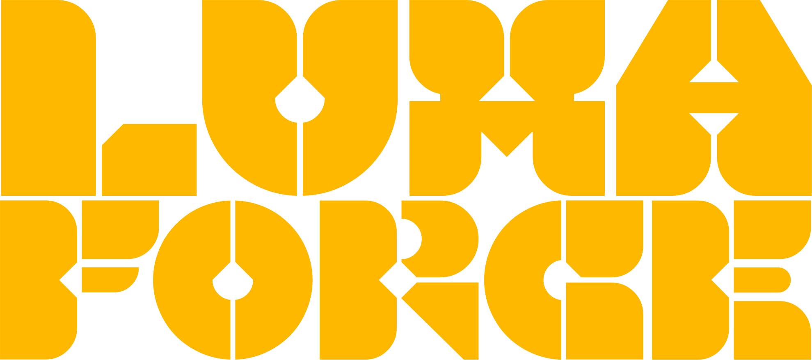

<div align="center">
  <h1>LUMAFORGE.</h1>
  <p><b>A professional, open-source color grading and optics engine built natively for the web.</b></p>

  [](https://opensource.org/licenses/MIT)
  [](https://reactjs.org/)
  [](https://supabase.com/)
  
  <br />
  
</div>

<br />

Lumaforge is a client-side photo editing environment designed to deliver advanced color control and precise image manipulation directly in the browser. It bypasses the need for heavy desktop software, offering a seamless, non-destructive editing experience.

## Key Features:

* **Steganographic Presets:** Lumaforge invisibly embeds your entire mathematical node tree into the metadata of your exported PNGs. Re-uploading any Lumaforge image back into the canvas seamlessly reconstructs your exact edit history and slider states.
* **Professional Optics:** Precision tools including non-linear RGB spline curves, cinematic split-toning, and high-dynamic-range exposure controls.
* **Universal `.CUBE` Export:** Build your aesthetic in the browser and export custom grades as industry-standard `.CUBE` LUTs for immediate integration into Premiere Pro, DaVinci Resolve, or After Effects.
* **The Uplink:** A built-in, community-driven platform. Publish your custom grades, browse public presets, and seamlessly "Fork & Remix" other creators' math directly onto your own local canvas.
* **Client-Side Processing:** 100% local browser rendering utilizing the Canvas API, featuring a 30-step non-destructive Undo/Redo history stack and lightning-fast WebP image compression.

## Tech Stack:

* **Frontend:** React.js, WebGL / Canvas API
* **Backend & Database:** Supabase (PostgreSQL)
* **Authentication & Storage:** Supabase Auth, Supabase Storage

## Getting Started:

To run Lumaforge locally on your machine:

1. **Clone the repository:**
   ```bash
   git clone [https://github.com/sganeshe/lumaforge.git](https://github.com/sganeshe/lumaforge.git)
   cd lumaforge
   ```

2. **Install dependencies:**
   ```bash
   npm install
   ```

3. **Configure Environment Variables:**
   Create a `.env` file in the root directory and add your Supabase credentials:
   ```env
   VITE_SUPABASE_URL=your_supabase_project_url
   VITE_SUPABASE_ANON_KEY=your_supabase_anon_key
   ```

4. **Start the development server:**
   ```bash
   npm run dev
   ```

## Roadmap:

The current architecture is actively being developed to support advanced capabilities, including:
* Integration of native **Computer Vision** processing pipelines.
* Implementation of **Machine Learning-driven semantic image segmentation** and automated spatial masking.

## Credits & Acknowledgements:

Designed and engineered by **Saumya Ganeshe**. 

Special thanks to the open-source communities behind React and Supabase for providing the foundational infrastructure to make browser-based compute accessible.

## License:

This project is open-source and available under the [MIT License](LICENSE).